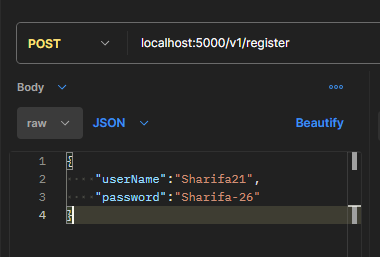

# User Onboard API

This is a RESTful API for User, built using Node.js, Express, and MySql. The API allows users to login, logout and view dashboard

## Description
It covers these concepts:
- Querying
- Fetch API.
- API integration.
- JWT Tokens
- Hash
- bcrypt

## Installation

1. Clone the repository:

   HTTPS: git clone https://github.com/Sharifa26/fruits.git
   
   SSH: git clone git@github.com:Sharifa26/fruits.git

2. Install dependencies: 
   
   npm install

3. Setup your datebase (you can use MySQL or SQLite or Postgresql):
   run this script in your Database ---->
   ``` 
    CREATE DATABASE IF NOT EXISTS express_auth;
    USE express_authusers;

    CREATE TABLE IF NOT EXISTS users (
    id INT AUTO_INCREMENT PRIMARY KEY,
    userName VARCHAR(255) UNIQUE,
    password VARCHAR(255),
    accessToken VARCHAR(255),
    login timestamp,
    logout timestamp
    );
   ```

4. Go to your Config file ->  change the config variable and add your own mysql credentials :

```
module.exports = {
 jwtSecret: '270ba49be904f5dd610fe30ad0262f7ecd7eb2c113ccc32af69f40c40407d071',

 //mySQL credentials.
 host: 'YOUR_HOST',
 user: 'YOUR_USER_ID',
 password: 'YOUR_USER_PASSWORD',
 database: 'express_auth'
}
```  

4. Start the server:

   npm start

## Usage

The API has the following endpoints:

##  localhost:5000/v1/register

## POST /v1/register

1. In this API I have used bcrypt npm to secure the hash password of the User.
2. Enter your Username and paasword for Register.


Content-Type: application/json

```
{
    "userName":"Sharifa21",
    "password":"Sharifa-26"
}
```
*Expample request:*



*Example response:*


HTTP/1.1 200 OK

Content-Type: application/json


## POST /v1/login

Login to the Application

 1. In this Application I have used jsonwebtoken and bcrypt npm packages to compare the Password and Generate the jwt Tokens.
 2. Enter your UserName and password to login the application.
 3. The result wil contains a token and copy the token to move further.

 Content-Type: application/json

```
{
    "userName":"Sharifa21",
    "password":"Sharifa-26"
}
```


*Example request:*


*Example response:*


## GET  /v1/dashboard

 1. Paste the Auth token in the Header u have copied from the login session.

*Example request:*


*Example response:*


## PUT /v1/logout

1. Paste the Auth token in the Header u have copied from the login session.

*Example request:*


*Example response:*


## Contributing

Pull requests are welcome. For major changes, please open an issue first to discuss what you would like to change.

